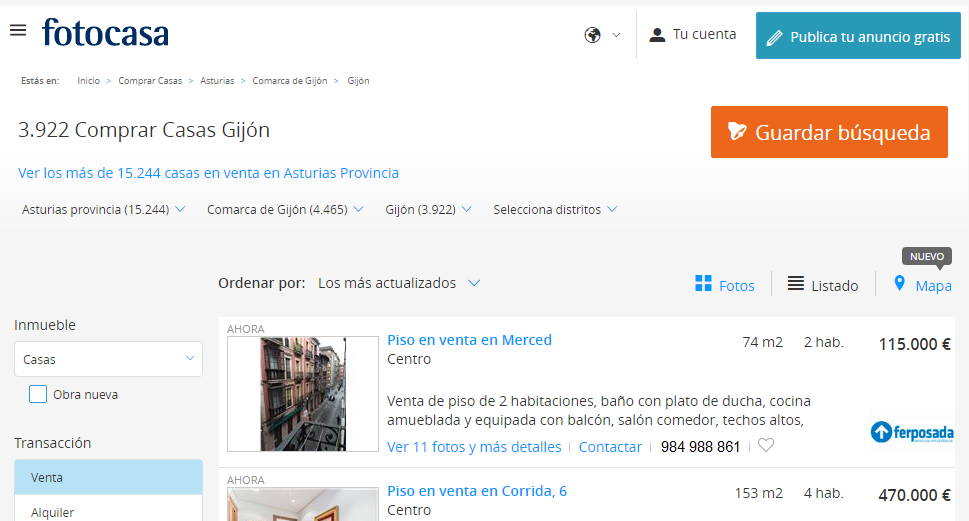
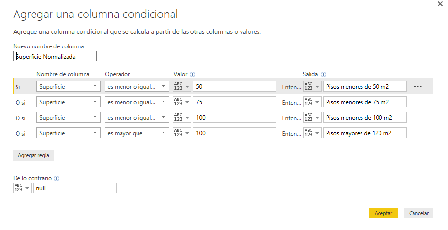

Lab 1. Ejemplo de conexión a servicios SaaS desde Power BI Service
================

Introducción
------------

*Nota* Extraido de https://powerbi.microsoft.com/es-es/documentation/powerbi-content-packs-services/

Puede conectarse a los paquetes de contenido de varios servicios que usa para dirigir su empresa, como Salesforce, Microsoft Dynamics y Google Analytics. Power BI comienza usando sus credenciales para conectarse al servicio y después crea un panel de Power BI y un conjunto de informes de Power BI que muestran sus datos automáticamente y proporcionan información visual acerca de su empresa.

Vea todos los paquetes de contenido de servicios iniciando sesión en Power BI. El equipo de Power BI está trabajando con otros servicios para agregar nuevos paquetes de contenido cada semana.

![imágen de los diferentes servicios SaaS de Power BI] (https://dpspowerbi.blob.core.windows.net/powerbi-prod-media/powerbi.microsoft.com/es-es/documentation/articles/powerbi-content-packs-services/20160804075537/overview.png)

Qué se incluye
------------
Después de conectarse a un paquete de contenido, verá un panel, un informe y un conjunto de datos recién creados. Los paquetes de contenido incluyen contenido desde el servicio que se centra en un escenario concreto y no incluyen toda la información del servicio. Después de la importación, puede personalizarlos para resaltar la información que más le interese. Se han programado los datos para que se actualicen automáticamente una vez al día. Puede controlar la programación seleccionando el conjunto de datos.

También puede usar Power BI Desktop para conectarse a algunos servicios, como Google Analytics y crear sus propios informes y paneles personalizados.

Para obtener más detalles sobre un paquete de contenido específico, consulte las páginas de ayuda individuales.

Veamos un ejemplo
------------
En este caso, vamos a conectar con el CRM corporativo de la empresa Izertis.
*Nota: este paquete de contenido se usa sólamente a efectos de ejemplo puesto que la información que contiene es información sensible de una empresa*.

1. Iniciamos sesión en Power BI Service.
2. Hacemos click en **Obtener Datos** ![Obtener Datos] (https://dpspowerbi.blob.core.windows.net/powerbi-prod-media/powerbi.microsoft.com/en-us/documentation/articles/powerbi-service-get-data/20160706081314/pbi_getdata_startscreen.png)

3. Buscamos el servicio **Microsoft Dynamics CRM Online Sales Manager** y hacemos click en **Obtener**
4. Escribimos la dirección del servicio `https://izertis.api.crm4.dynamics.com` y seleccionamos autenticación de tipo **OAuth2**
5. Si la introducción de las creedenciales ha sido correcta pronto veremos la actualización. 

![Imagen de CRM Online][CRM]

[CRM]: CRM_SaaS.PNG

Juguemos alrredor de este conjunto de Datos
------------
Veamos por ejemplo como enviar los datos de CRM a una Tabla dinámica de MS Excel.

BING como servicio SaaS
------------
![Imágen de Bing][BING]

[BING]: BING_SaaS.PNG

Probar con la palabra clave **ISIS**

Probemos con la WEB
------------
El siguiente ejemplo es un ejercicio que podemos hacer **tod@s juntos**.

Vamos a ir paso a paso:

1. Accedamos al siguiente enlace: 

http://www.fotocasa.es/comprar/casas/gijon/listado?crp=1&ts=gij%C3%B3n%20&llm=724,3,33,481,984,33024,0,0,0&opi=36&ftg=false&pgg=true&odg=false&fav=false&grad=false&fss=false&mode=3&cu=es-es&craap=1&fs=false&tta=8 

2. Si todo ha ido bien veremos algo así:

3. Lo que vamos a hacer es capturar los datos de los pisos en venta en Gijón ahora mismo directamente desde la web (sin pedir permiso :)). Técnicamente este proceso se denomina *web-scrapping*

4. Para ello, vamos a abrir **Power BI Desktop** -> **Obtener Datos** -> **Web** y pegamos el enlace anterior en el cuadro disponible para ello. Hacemos click en **Aceptar**

5. En el previsualizador vemos dos elementos **Document** y **Table 0** seleccionamos **Table 0** y hacemos click en **Editar**

6. Ahora mismo estamos en el **Editor de Consultas**. Renombramos las columnas haciendo doble click sobre cada una con los siguientes nombres: 

* Actualización
* Descripción
* Superficie
* Habitaciones
* Precio

7. Eliminamos la última columna. Para ello, hacemos click con boton derecho sobre la columna y seleccionamos **Quitar**.
8. Seleccionamos la columna **Precio** -> **Remplazar valores** y eliminamos el caracter *€*
9. Formateamos la columna **Precio** como número decimal. Seleccionamos la columna **Precio** -> **Transformar** -> **Tipo de Datos** -> **Número decimal**. Dar formato de *€*.
10. Seleccionamos la columna **Precio** y hacemos click con boton derecho. Seleccionamos **Quitar errores**.
11. Seleccionamos la columna **Habitaciones** y eliminamos los caracteres *hab.* utilizando la opción de **reemplazar valores**. Formateamos como número entero. 
12. Hacemos lo mismo con la columna **Superficie** y los caracteres *m2*. Formateamos como número entero.
13. Aplicamos y cerramos el editor de consultas.

**IMPORTANTE** Renombramos tanto la pagina del informe como el conjunto de datos con **MisPisos**

Bien, ahora ya podemos empezar a trabajar las visualizaciones.

1. Hagamos un gráfico de barras con los precios de las viviendas en función del número de habitaciones. Edita el formato del eje y para mostrar los precios en miles de Euros.
2. Observa que ocurre. ¿Es intuitivo el resultado? ¿Tiene sentido que los pisos de 4 habitaciones cuesten menos dinero que los de 2 y 3 habitaciones?¿Qué cantidad estamos representando en la variable **precio**?
 
*Nota: Ajusta la agregación de la variable Precio*

1. Hagamos ahora una tabla con las descripciones de los pisos.

Finalmente, nos puede interesar conocer el precio promedio de los pisos en Gijón en función de los metros cuadrados. 
*Nota: edita el formato del eje y para mostrar los precios en miles de Euros*.

Para representar esto, vamos a utilizar de nuevo un gráfico de barras con el precio en función de los metros cuadrados.
Observa lo que ocurre. ¿Responde este gráfico a mi pregunta?

Hagamos lo siguiente:
1. Volvamos al editor de consultas para hacer una transformación en los datos. 
2. Vamos a añadir una **columna condicional**. Para ellos vamos a **Agregar columna** -> **Columna condicional**

Vamos a configurar la columna de la siguiente manera:

3. Pasar el gráfico de barras a barras horizontales y seleccionar el nuevo campo **Superficie Normalizada**

Ya casi hemos terminado :)

Vamos a añadir un par de indicadores numéricos en forma de tarjeta reelevantes para nuestro informe.

1. Vamos a la vista de datos y creamos una nueva columna con la siguiente fórmula `Precio por Metro Cuadrado = MisPisos[Precio]/MisPisos[Superficie]`. Formateamos como *€* y dejamos con 0 decimales.
2. Vamos a la vista de datos y creamos una nueva columna con la siguiente fórmula `Precio por Habitación = MisPisos[Precio]/MisPisos[Habitaciones]`. Formateamos como *€* y dejamos con 0 decimales.
3. Para crear las tarjetas, pinchamos en una zona blanca del lienzo y a continuación seleccionamos la visualización **Tarjeta** en el menú de las visualizaciones. Arrastramos el campo **Precio Metro Cuadrado**. Seleccionamos tipo de agregación **Promedio** y quitamos el formato automático de la etiqueta de datos.
4. Repetimos el paso anterior arrastrando la variable **Precio por Habitación**.

Vamos a colocar un título a nuestro informe de pisos en Gijón. Para ello hacemos click en **Nuevo cuadro de Texto**
Escribimos *Mis Pisos en Gijón*. Colocamos un recuadro de color alrededor.

**IMPORTANTE** **Observar el proceso de actualización de la WEB**

**FINALMENTE** **Publicar y Guardar**

Enlaces de Interés. Repositorios OpenData
------------
http://datos.gob.es/sites/all/themes/zen/aportabis/logo.png
http://www.eldiario.es/turing/big_data/Mapa-iniciativas-Open-Data-Espana_0_277172540.html

