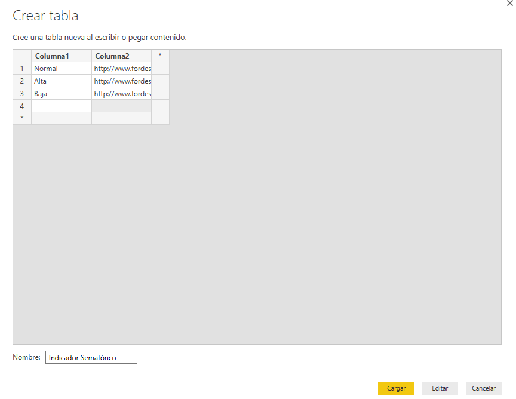

Lab 2. Ejemplo de modelado de datos complejo con Power BI
================

Introducción
------------

Bien!, hasta ahora hemos jugado con modelos de datos sencillos en Power BI. En estos ejemplos hemos trabajado siempre con un único conjunto de datos (*tabla*). En el mundo real, normalmente tenemos que trabajar con modelos de datos que habitualmente están compuestos por diversas tablas relacionadas entre si (*modelo relacional*)

En este ejemplo, vamos a extraer los datos de incidencias de un sistema CRM. En la primera parte, introduciremos el concepto de **relaciones** y veremos como se trabaja y que implicaciones tiene. En la segunda parte, introduciremos el concepto de **Medida** y veremos las diferencias con las columnas calculadas.

Explorando el modelo de datos actual.
------------
*Nota: esta primera parte de conexión con el CRM y extracción de datos la hace solamente el instructor*

1. Descargar y guardar el fichero de Excel en la carpeta de trabajo.
2. **Obtener Datos** -> **Excel** -> **Editar**
3. Eliminar las dos primeras columnas. Puedes selecionar las columnas a la vez haciendo click en una y a continuación en otra manteniedo la tecla **Shift** pulsada.
4. Renombramos la columna *(No modificar) Fecha de modificación* por *Fecha Modificación*
5. Eliminamos la columna Región.
6. Formateamos las columnas con fechas a tipo **Fecha**
7. Renombramos la tabla o conjunto de datos como **Incidencias**
8. Aplicamos y Cerramos.

Relaciones
------------

1. Pasa a la vista de **Datos** y haz click en **Especificar Datos**
2. Crea la siguiente tabla:

Aquí teneís los links para copiar:

- Alta --> http://www.fordesigner.com/imguploads/Image/cjbc/zcool/png20080526/1211811447.png
- Normal --> http://www.fordesigner.com/imguploads/Image/cjbc/zcool/png20080526/1211811481.png
- Baja --> http://www.fordesigner.com/imguploads/Image/cjbc/zcool/png20080526/1211811461.png

3. Renombra las columnas de la nueva tabla como **Prioridad** y **Indicador**
4. Categoriza la columna **Indicador** como **Dirección URL de la imágen** en el menú Categoría de Datos.

Ahora, tenemos 2 tablas en nuestro modelo de datos. Cada una tiene una columna llamada **Prioridad*.
Vamos a **RELACIONARLAS**

1. Pasa ahora  la vista **Relaciones**.
2. Haz click en el campo **Prioridad** de la tabla Incidencias y *arrastra* hasta el campo **Prioridad** en la Tabla *Indicador Semafórico*
3. Abre el menú de Administrador de Relaciones y observa la explicación del Instructor.

Visualizamos las Relaciones
------------

1. Seleccionamos una visualización de tipo tabla.
2. Arrastra el campo **Indicador** de la tabla Indicador Semafórico.
3. Haz lo mismo con el campo **Prioridad** de la tabla Incidencias
4. Repite el paso anterior. Selecciona tipo **Recuento**
5. Filtra los resultados de tal manera que solo se muestren los campos con Prioridad Alta, Baja y Normal. Es decir, filtra de manera que no se muestren los campos vaciós o sin prioridad asignada.
6. Aumenta el tamaño de la fuente de la tabla a 30 para verlo mejor.

Introducción práctica al concepto de Medida
------------
1. Vuelve un momento al **Editor de Consulta** y crea una nueva **Columna ïndice** comenzando con el índice 1.
2. Aplica y Cierra
3. Inserta una visualización de tipo **Tarjeta**
4. Arrastra el campo Prioridad y ajusta la variable para que se calcule el **Recuento**. Dale formato para que se vea bien. Titula como **Número Total de Incidencias**
5. Crea una nueva visualización de tipo **Segmentación de Datos**. Arrastra el campo Indicador de la tabla Indicador Semafórico.
6. Prueba a filtrar los datos dinámicamente. Observa que le ocurre al **Número Total de Incicencias**

*Explicación* Si tenemos filtrado un tipo de incidencia **perdemos** la información sobre el **número total de incidencias**. Esto no es aceptable por el Responsable de Mantenimiento que necesita saber en todo momento como evoluciona el número total de incicencias.

Creamos nuestra primera Medida (Explicita)
------------
1. Volvemos a la vista de **Datos**
2. **Modelado** -> **Nueva Medida** -> 
  
  `Incidencias Totales = CALCULATE(COUNT(Incidencias[Índice]);ALL('Indicador Semafórico'))`

3. Volvemos al panel de **Informe**
4. Copiamos (*CRTL+C*) la visualización anterior de la tarjeta y pegamos (*CRTL+V*) al lado. 
5. Sustituimos el campo por la nueva medida que hemos creado **Incidencias Totales **
6. Observa lo que ocurre ahora que actuamos sobre los filtros de prioridad de incidencia.
7. Vamos a Calcular ahora el %de cada tipo de incidencia.
8. Volvemos a la vista de **Datos**
9. **Modelado** -> **Nueva Medida** -> 
  
  `Porcentaje de Incidencias = COUNT(Incidencias[Índice])/Incidencias[Incidencias Totales] `

10. Formateamos como `%` y eliminamos decimales.
11. Creamos una nueva tarjeta con esta medida y colocamos a lado de la medida de incidencias que varía en función de la prioridad.

